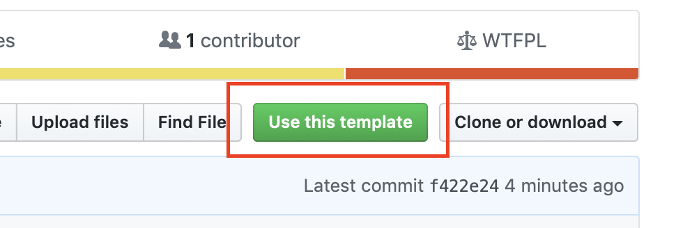

# Webapp Boilerplate

### Use this boilerplate as template



### Installation

```bash
# Install node dependencies
$ npm install
```

### Run application

```bash
# Before the first run, you have to compile the app
$ npm run compile

# Run application
$ npm run start
```

```bash
# Run application in developer mode
$ npm run dev
```

### Add routes / views

Text

### Components

Text

### Assets (Scss / Js)

Text
