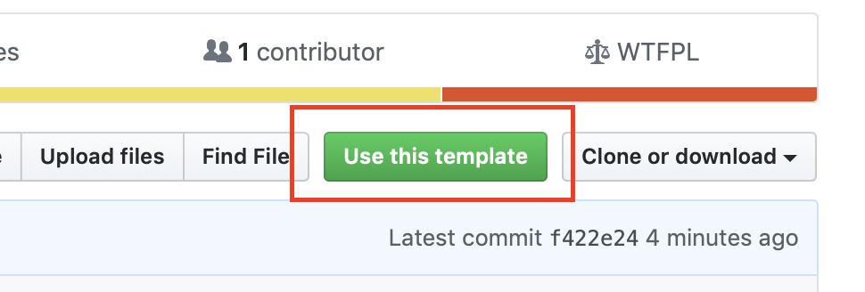

# Webapp Boilerplate

### Use this boilerplate as template



First of all, use this repository as template for your new web application by clicking the green button on top of this repository. After that, you have to clone your new repository to your local pc.

```bash
# Clone repository
$ git clone https://github.com/YourUsername/YourRepository.git
```

### Installation

Install all node modules to get things work.

```bash
# Install node dependencies
$ npm install
```

### Compile application

Before you start your web application, you have to compile the app. This step is required bevor the first run and after every file change.

```bash
# Compile your webapp
$ npm run compile
```

### Run application

```bash
# Run application
$ npm run start
```

Or you can run the app in developer mode, so the app is compiling itself after filechanges and reload its contents in browser.

```bash
# Run application in developer mode
$ npm run dev
```

### Add routes / views

Add a new route in `/routes.json` and the matching view in the `/view` directory as `.marko` file.

### Components

Components are written in [marko.js](https://github.com/marko-js/marko). Add new components in the `/components` directory.

### Assets (Scss)

Write your stylesheets in CSS or SCSS and save them to `/src/sass` and import them to `style.scss`. This stylesheet file will be compiled and included in your application html head.

## Docker Container

### Build Image from Dockerfile

```bash
$ docker build -t <username>/<image> .
```

### Run Container from Image

The following command start a docker container from your image and map port 8080 to port 3000.

```bash
$ docker run -it -p 3000:8080 <username>/<image>
```

After running the commands above, go to: <http://localhost:3000>
