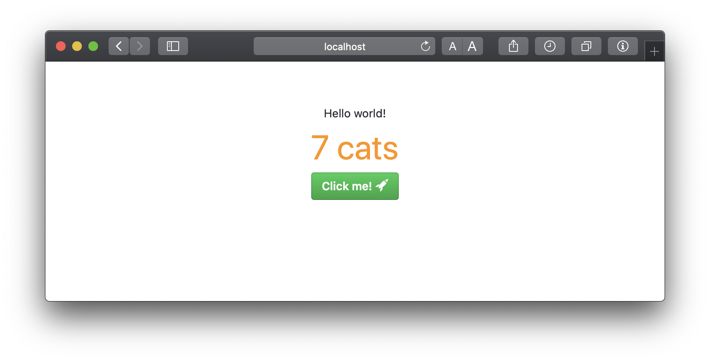

# Boilerplate for Node.js Webapplications with Express.js, Marko.js & Webpack 🧙



### Features

- Marko.js 🧩
- Express.js 🚂
- i18n internationalization 🌐
- Webpack 📦
- GitHub Primer 🎨
- FontAwesome 🔣
- Octicons :octocat:
- jQuery 🧸
- Outdated browser warning generated from `.browserslistrc` 🚨
- Hot reloading after filechanges 🔥

This boilerplate works also on a Microsoft IIS server & in Docker container!

### Use this boilerplate as template


First of all, use this repository as template for your new web application by clicking the green button on top of this repository. After that, you have to clone your new repository to your local pc.

```bash
# Clone repository
$ git clone https://github.com/YourUsername/YourRepository.git
```

### Installation

Install all node modules to get things work.

```bash
# Install node dependencies
$ npm install
```

### Build application

Before you start your web application, you have to compile the app. This step is required bevor the first run and after every file change.

```bash
# Build your webapp
$ npm run build
```

### Run application

```bash
# Run application
$ npm run start
```

Or you can run the app in developer mode, so the app is compiling itself after filechanges and reload its contents in browser.

```bash
# Run application in developer mode
$ npm run dev
```

### Add routes / views

Add a new route in `/app/routes.js` and the matching view in the `/app/view` directory as `.marko` file.

### Components

Components are written in [marko.js](https://github.com/marko-js/marko). Add new components in the `/app/components` directory.

### Stylesheets

Write your stylesheets in CSS or SCSS and save them to `/app/style` and import them to `style.scss`. This stylesheet file will be compiled and included in your application.

### Language variables

All language variables are stored in `/app/locales` and can be accessed by a marko.js component. The boilerplate uses the i18n module for browser. Change language with query parameter `lang` i.e. `http://localhost:8080/?lang=de`

```marko
// Simple language variable
<lang var="greeting" /> // -> Hello world!

// Language variable with value (value can also be an array of values)
<lang var="interpolatedGreeting" value="Andre" /> // -> Hello Andre!

// Language variables with singular and plural
<lang var="cats" value="1" plural=true /> // -> One cat
<lang var="cats" value="2" plural=true /> // -> 2 cats
```

### Octicon component

Read documentation of [octicons-marko](app/components/octicon/README.md). :octocat:

### Environment variables

Create an `.env` file in the root directory of your web app.

```env
# Sample...
GITHUB_CLIENT_ID="11e92....df3"
GITHUB_CLIENT_SECRET="27bfd2..........84e66d7"
```

```javascript
// Access environment variables
const githubClientId = process.env.GITHUB_CLIENT_ID
console.log(githubClientId)
```

## Docker container

### Build image from Dockerfile

```bash
$ docker build -t webapp_name .
```

### Run container from image

The following command start a docker container from your image and map port 8080 to port 3000. 🔮

```bash
$ docker run -it -p 3000:8080 webapp_name
```

After running the commands above, go to: <http://localhost:3000>
